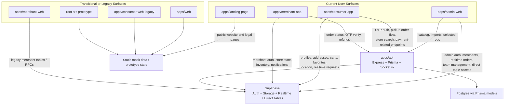

# Pick At Store System Map

Last reviewed: 2026-03-14

Scope: This document maps the repository as it exists in source control today. It is a repo-derived architecture reference, not a deployment audit. It is meant to answer four questions:

1. What is the current architecture?
2. Which surfaces are legacy or transitional?
3. How is the data model split today?
4. What should be treated as the practical source of truth?

## Status Legend

- Current: actively implemented and closest to present-day product behavior.
- Transitional: still useful or possibly operational, but not the clearest product authority.
- Legacy: prototype, reference, or older implementation that should not drive new decisions.

## Executive Summary

- The repo contains one product family, `Pick At Store`, across customer, merchant, admin, backend, and public marketing surfaces.
- The platform spine is still Supabase: auth, storage, realtime, and several direct table integrations.
- A newer Express + Prisma backend now carries much of the catalog, store, inventory, and order orchestration logic.
- The most current product surfaces are:
  - `apps/admin-web`
  - `apps/api`
  - `apps/consumer-app`
  - `apps/merchant-app`
  - `apps/landing-page`
- The main transitional surface is:
  - `apps/merchant-web`
- The main legacy/prototype surfaces are:
  - `apps/web`
  - `apps/consumer-web-legacy`
  - root `src/`

## Current Architecture

### High-Level Shape

### Current Surfaces

| Surface | Purpose | Status | Primary backend path | Notes |
| --- | --- | --- | --- | --- |
| `apps/admin-web` | Admin operations, merchant onboarding/KYC, catalog, team management | Current | Mixed: direct Supabase + API | Strongest admin tool; several analytics/finance/marketing modules are still partly simulated |
| `apps/api` | Core backend for catalog, store/search, orders, OTP auth, payment hooks | Current | Prisma + Supabase helper access | Most important consolidation layer for operational backend logic |
| `apps/consumer-app` | Main customer mobile app | Current | Mixed: direct Supabase + API | Most complete customer journey |
| `apps/merchant-app` | Main merchant mobile app | Current | Mixed: direct Supabase + API | Most complete merchant operations app |
| `apps/landing-page` | Public marketing and legal pages | Current | Static Next.js app | Best public-facing product narrative |

### Architecture Notes

- Supabase is still doing more than "infrastructure". It is both the identity system and a live application data layer.
- The API is not just a thin wrapper. It is already the canonical execution layer for several important flows:
  - product catalog
  - consumer store search and store detail
  - order lifecycle
  - OTP auth
  - refunds
  - product import/export and media upload
- Several frontend apps still bypass the API for important business data.
- Because of that, the repo currently has a hybrid architecture rather than a single clean backend boundary.

## Legacy Surfaces

### Transitional Surface

| Surface | Classification | Why it is not fully current |
| --- | --- | --- |
| `apps/merchant-web` | Transitional | Real auth, onboarding, orders, and inventory exist, but it uses older table/RPC conventions such as `orders` and `store_inventory`, and it overlaps with the more complete `apps/merchant-app` |

### Legacy and Prototype Surfaces

| Surface | Classification | Why it should not be treated as authority |
| --- | --- | --- |
| `apps/web` | Legacy prototype | Newer-looking customer web shell, but it runs on mock data and local React context instead of the live operational backend |
| `apps/consumer-web-legacy` | Legacy prototype | Figma-export style Vite app representing an older customer flow |
| root `src/` | Legacy prototype | Old wireframe/prototype surface; root README still describes the repo as a Figma wireframe bundle |

### Practical Rule

- Use current surfaces to understand present behavior.
- Use transitional surfaces only when maintaining that exact surface.
- Use legacy surfaces as design/reference material, not as system truth.

## Data Model Split

The repo currently operates across three overlapping data layers.

### 1. Supabase-Native Application Data

This layer is still heavily used by the mobile apps and parts of admin:

- Auth and session management
- Storage buckets and document uploads
- Realtime subscriptions
- Customer profiles and profile-completion state
- Customer addresses
- Customer carts and cart items
- Favorite stores and favorite products
- Merchant KYC and onboarding fields in `merchants`
- Merchant branches in `merchant_branches`
- Notification records in `notifications`
- Some legacy `orders` / `order_items` flows

### 2. API + Prisma Domain Models

This layer is strongest in the backend and increasingly central to current operations:

- `User`
- `Store`
- `Product`
- `ProductImage`
- `ProductAuditLog`
- `StoreProduct`
- `Order`
- `OrderItem`
- `City`
- `ServiceArea`
- `OtpVerification`
- `Notification`
- merchant and subscription models in Prisma

This layer powers:

- product catalog APIs
- consumer store detail/search APIs
- order creation and order status orchestration
- OTP verification and completion logic
- stock decrement and low-stock notifications

### 3. Static Mock or Frontend-Local Data

This layer is still present in several surfaces:

- `apps/web`
- `apps/consumer-web-legacy`
- root `src/`
- parts of `apps/consumer-app` storefront and dining content
- parts of `apps/merchant-app` fallback order experiences

This is useful for UX development, but it is not an authoritative application datastore.

### Duplicated or Split Domains

| Domain | Current split |
| --- | --- |
| Orders | Prisma/API uses `"Order"` / `"OrderItem"` while legacy and some direct-Supabase paths use `orders` / `order_items` |
| Inventory | Current mobile/admin paths use `"StoreProduct"`; transitional merchant web uses `store_inventory` |
| Products | Current API/admin paths use `"Product"` and product endpoints; older SQL and legacy surfaces still reference lowercase `products`-style patterns |
| Users and identity | Supabase Auth user, Prisma/Supabase `User` table, and customer `profiles` table each hold part of identity |
| Merchant data | Merchant onboarding/KYC lives mainly in Supabase `merchants`, while store operations also depend on Prisma `Store` |
| Customer state | Customer app uses real Supabase tables for profile, favorites, carts, and addresses, while customer web prototypes use local state and mock data |

### Domain-by-Domain Data Split

| Domain | Active current path | Secondary or legacy path |
| --- | --- | --- |
| Admin identity and authorization | Supabase Auth + `User` table role checks | None meaningful |
| Customer identity | Supabase Auth + `profiles` | Prototype web onboarding/local state |
| Merchant identity | Supabase Auth + `merchants` | Merchant web older assumptions |
| Merchant KYC | Supabase `merchants`, `merchant_branches`, storage buckets | None stronger |
| Master catalog | API + Prisma `Product` model | Transitional direct reads in older surfaces |
| Store inventory | Prisma `StoreProduct` and API-backed operations | `store_inventory` in `apps/merchant-web` |
| Pickup order lifecycle | API + Prisma `Order` / `OrderItem` | Some older direct-table patterns |
| Dining order history and some direct writes | Supabase `orders` / `order_items` in consumer-side flow | None stronger today for that exact flow |
| Favorites and cart | Supabase direct tables | Mock web context in `apps/web` |
| Notifications | Supabase `notifications` + realtime | Merchant web localStorage only stores sound settings, not canonical notifications |

## What Should Be Treated As Source Of Truth

This section distinguishes between:

- Practical source of truth today: the layer a maintainer should trust first when trying to understand real behavior in this repo.
- Recommended source of truth going forward: the layer that should own the domain if the repo is gradually unified.

### Source-of-Truth Matrix

| Domain | Practical source of truth today | Recommended source of truth going forward | Notes |
| --- | --- | --- | --- |
| Repo governance and locked-surface rules | `FEATURE_REGISTRY.md` and `PROJECT_GUIDELINES.md` | Same | These are process authority, not runtime authority |
| Public marketing and legal pages | `apps/landing-page` | Same | Treat this as canonical for public-facing web and legal copy present in repo |
| Authentication and session issuance | Supabase Auth | Same | All current operational apps depend on it |
| Admin role authorization | Supabase `User` table | Same unless auth stack is reworked | `apps/admin-web` depends on role checks beyond raw auth |
| Customer profile completion | Supabase `profiles` | Same | Consumer app uses this directly |
| Customer addresses | Supabase `consumer_addresses` | Same | Consumer app treats this as live state |
| Customer cart and favorites | Supabase direct tables | Same or an API wrapper later | Operational reality is still Supabase direct |
| Merchant onboarding and KYC | Supabase `merchants`, `merchant_branches`, storage buckets | Same unless migrated deliberately | This is where the real onboarding state lives |
| Master product catalog | API + Prisma `Product` | API + Prisma `Product` | This is already the clearest current authority |
| Store inventory | Prisma `StoreProduct` and related API/admin/mobile paths | Prisma `StoreProduct` | `store_inventory` should be treated as legacy/transitional |
| Consumer store discovery | API endpoints | API endpoints | Strongest current backend boundary for customer storefront data |
| Pickup order lifecycle | API + Prisma `Order` / `OrderItem` | API + Prisma `Order` / `OrderItem` | Best candidate for unified order authority |
| Dining order flow currently written directly from consumer app | Supabase `orders` / `order_items` | Move toward API + Prisma `Order` / `OrderItem` if consolidating | This is the biggest live split in the repo |
| Merchant notifications | Supabase `notifications` + realtime | Same, unless centralized through API later | Merchant web sound settings are not the same thing as operational notification state |

### Practical Decision Rules

If two surfaces disagree:

1. Trust current surfaces over transitional or legacy surfaces.
2. Trust API + Prisma for catalog, store, inventory, and pickup-order orchestration.
3. Trust Supabase direct tables for customer profile/address/cart/favorites and merchant onboarding/KYC.
4. Treat `apps/web`, `apps/consumer-web-legacy`, and root `src/` as non-authoritative for business logic.

## Known Inconsistencies

These are the most important repo-level mismatches discovered during review.

### 1. Order stack is split in two

- The newer backend uses Prisma-style `"Order"` / `"OrderItem"` and API routes.
- Some customer-side and transitional flows still use direct Supabase `orders` / `order_items`.
- This is the single biggest structural split in the repo.

### 2. Inventory stack is split in two

- `apps/merchant-app`, admin tooling, and API-backed flows align with `"StoreProduct"`.
- `apps/merchant-web` still uses `store_inventory`.

### 3. Merchant onboarding status behavior differs by surface

- Merchant web follows a real pending/review/rejected model.
- Merchant mobile signup currently writes merchant status in a way that does not fully match that pending-review UX.

### 4. Some admin UI expects backend routes that are not present in the current API file

- Example: admin city management requests `/cities`, but the current API server file does not define that route.

### 5. Customer web app is cleaner than the old prototypes but still not live-backed

- `apps/web` looks modern and product-shaped.
- It should still be treated as prototype-level for system truth because it depends on mock data and local context.

### 6. Documentation quality is uneven

- Governance docs are strong.
- Most READMEs are generic scaffolds.
- Some older planning docs no longer match current implementation.

## Recommended Mental Model For Maintainers

### If you are working on admin

- Start with `apps/admin-web`.
- Expect a hybrid model: some data comes direct from Supabase, some from the API.
- Treat the catalog APIs as stronger authority than older direct-table assumptions.

### If you are working on customer mobile

- Start with `apps/consumer-app`.
- Expect Supabase direct access for identity-adjacent and customer-state data.
- Expect API usage for OTP auth, store search, and pickup-order orchestration.

### If you are working on merchant operations

- Start with `apps/merchant-app`.
- Use `apps/merchant-web` only if you are deliberately maintaining that surface.

### If you are working on public marketing or legal copy

- Start with `apps/landing-page`.

### If you are trying to understand "the old customer web app"

- Check `apps/web` for newer prototype UX.
- Check `apps/consumer-web-legacy` and root `src/` only for older reference/history.

## Short Version

- Current core stack: `admin-web` + `consumer-app` + `merchant-app` + `api` + `landing-page`
- Transitional: `merchant-web`
- Legacy: `apps/web`, `consumer-web-legacy`, root prototype
- Supabase is still the platform spine
- API + Prisma is the clearest current backend authority for catalog, store, inventory, and pickup-order orchestration
- Customer profile/address/cart/favorites and merchant KYC/onboarding still live most directly in Supabase
- Orders are the largest unresolved split and should be treated carefully whenever cross-surface behavior is involved
